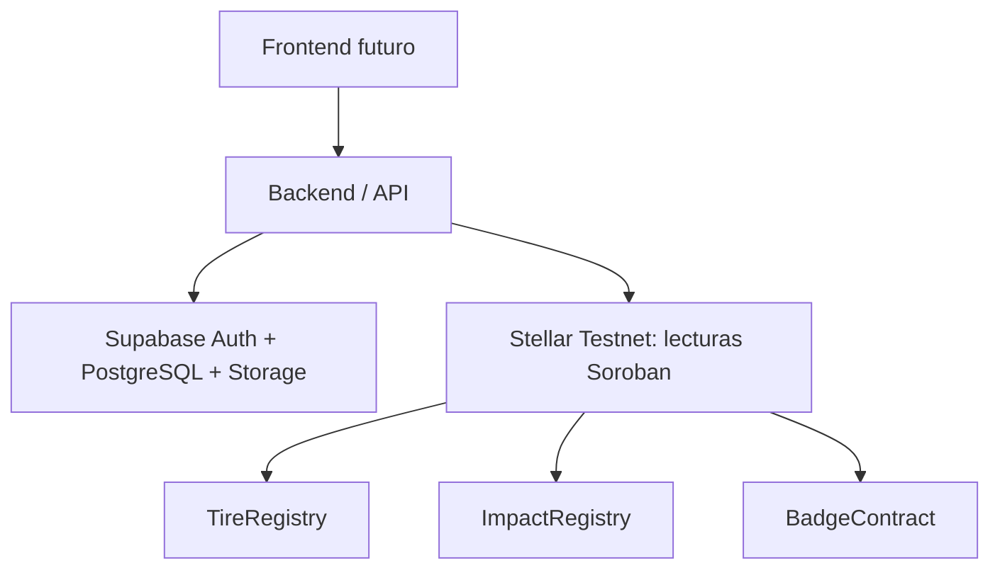

# Arquitectura off-chain — Fase 6

**Stellar es la fuente de verdad** para ID de lote, actores blockchain, flujo, masas registradas, evidencia hash, impacto acreditado, TirePoints y badges. Los tres contratos conservan su código y despliegues anteriores. El backend no escribe en ellos; toma sus IDs de `deployments/testnet.json`.

**Supabase conserva metadata operativa:** organizaciones aprobadas y su dirección pública, membresías de usuarios, etiquetas humanas, vínculos a lote/contrato/red, referencias de evidencia y eventos de aplicación. No existen columnas de estado, masas, TirePoints ni badges modificables en sus tablas. No se implementa caché canónico en esta fase.

**La evidencia** se almacena en un bucket privado e inmutable para clientes. La base guarda ruta, hash, tamaño, tipo y nombre. El backend calcula SHA-256 al recibir el archivo y lo vuelve a comprobar al descargarlo. Comparar ese hash con el de TireRegistry es una comprobación separada de la integridad del archivo; ninguna demuestra por sí sola tratamiento físico.

**Autorización:** Supabase valida el JWT; PostgreSQL aplica RLS con membresías persistidas en profiles, no con user_metadata editable. Un operador confiable provisiona organizaciones y perfiles tras verificar identidad y dirección. Los usuarios no pueden cambiar su organización ni darse rol de planta. La empresa crea metadata de sus lotes y los tres participantes leen los lotes asignados. Participantes pueden agregar evidencia; no pueden reasignar el lote, reemplazar archivos ni falsificar eventos generados por triggers.

Las organizaciones forman un directorio mínimo visible solo a usuarios inscritos: nombre, tipo y dirección Stellar. No contiene contactos ni información privada de empresa. Los lotes, archivos, eventos y perfiles permanecen restringidos. No se habilita información anónima pública; un futuro dashboard público requiere proyección y políticas explícitas.

**Verificación:** una referencia en Supabase es metadata no verificada hasta consultar TireRegistry y cotejar ID, despliegue y direcciones de las tres organizaciones. El backend comprueba las fuentes canónicas de ImpactRegistry y BadgeContract antes de devolver reconocimiento. No admite saldo, badge ni masa como entrada. Enteros on-chain se devuelven como cadenas decimales; no se pierden u64/u128 al parsear JSON.

**Límites operativos:** lecturas de varios contratos no son una instantánea atómica; fallos de red producen errores y no un saldo inventado. Aún falta onboarding operativo de organizaciones/usuarios, HTTPS/hosting de la API, política de recuperación de subidas fallidas y mantenimiento TTL de Stellar. No hay frontend, pagos, escrow, stablecoins, IoT, RETC, oráculos ni Mainnet.

Referencias consultadas: [RLS de Supabase](https://supabase.com/docs/guides/database/postgres/row-level-security), [Storage access control](https://supabase.com/docs/guides/storage/security/access-control), [PGlite](https://pglite.dev/docs/), [parseo numérico sin pérdida](https://github.com/josdejong/lossless-json). El changelog de Supabase fue revisado: esta migración no usa ltree, cifrados legacy, btree_gist ni operadores personalizados afectados por la actualización de septiembre de 2026.
